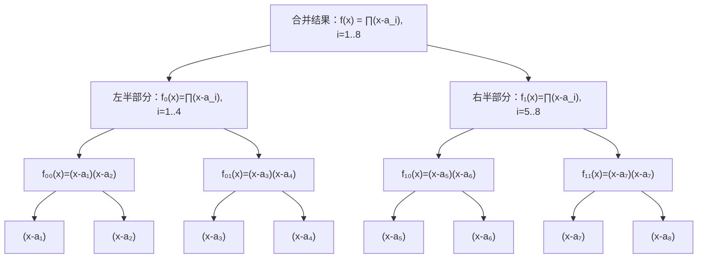

若模 $m$ 下阶 $\delta(g)$ 存在，则 $\delta(g)|\varphi(m)$ 
### 定理（原根存在定理）
只有 $m = 2, 4, p^a, 2p^a$ 存在原根
暴力判断即可
$g$ 为正整数，且$(g, m) = 1$ 。则 $g$ 是 $m$ 的原根当且仅当对于任意 $\varphi(m)$ 的质因子 $q_i$ ，$g^{\frac{\varphi(m)}{q_i}} \not\equiv 1 \pmod{m}$  
暴力寻找最小原根，一般来说，最小原根在 $m^{\frac{1}{4}}$ 范围内。
Luogu P6091
### 指标
对于质数 $p$，假设 $g$ 是 $p$ 的一个原根，则 $g^0, g^1, \ldots, g^{p-2}$ 在模 $p$ 意义下是 $1, 2, \ldots, p-1$ 的一个排列。假设对于 $1 \le x \le p-1$ 有 $g^c \equiv x \pmod{p}$，则称 $x$ 的指标为 $c$，记作
$$
\operatorname{ind}(x) = c
$$
因为具有类似对数的性质。
又称离散对数
$$
\begin{align}
\forall 1\le x,\ y < p,\quad \text{ind}(xy) &\equiv \text{ind}(x) + \text{ind}(y) \pmod{ \varphi(p)} \\
\Leftrightarrow \log(xy) &= \log x + \log y
\end{align}
$$
$$
\begin{align}
\text{ind}(x^c) &\equiv c\cdot \text{ind}(x) \\
\Leftrightarrow \log(x^c) &= c \cdot \log x
\end{align}
$$
- 如何求指标？baby step giant step(BSGS)
$$
g^c \equiv x \pmod{p}
$$
设 $B = \lceil \sqrt{p} \rceil$ ，$c= a\cdot B + b$ ，且 $a, b < B$ ，则要求
$$
{(g^B)}^a \cdot g^b \equiv x
$$
那么
$$
0 \le a < B \rightarrow {(g^B)}^0, \ {(g^B)}^1 \dots {(g^B)}^{B-1}
$$
$$
0 \le b < B \rightarrow {(g^{-1})}^0, \ {(g^{-1})}^1 \dots {(g^{-1})}^{B-1}
$$
用 hash 表存起来第一行，再用另一行试乘，就可以得到 $a$ 和 $b$ 
### SGU 261
求方程 $x^K \equiv A \pmod{P}$ 的所有根，其中 $P$, $K$ 均为质数。$(2 \le P \le 10^9, \quad 2 \le K \le 10^5, \quad 0 \le A < P)$

$$
\begin{align}
x^k &= A \\
\ln(x^k) &= \ln(A) \\
k\ln(x) &= \ln(A) \\
\ln(x) &=\frac{\ln(x)}{k} \\
x &= e^{\frac{\ln(A)}{k}} = A^{\frac{1}{k}}
\end{align}
$$
$$
\begin{align}
k \cdot \text{ind}(x) &\equiv \text{ind}(A) \pmod{P - 1} \\
\text{ind}(x) &\equiv C \pmod{ [k, p - 1]} \\
x &\equiv g^{\text{ind}(k)}
\end{align}
$$
>疑似错误，同余方程的周期是 $\frac{p-1}{\gcd(k, p - 1)}$ 

 ### NTT
 - 假设质数 $p$ 满足 $p=r2'+1$ , $g$ 是 $p$ 的原根
 - 使用 $g_n = g^{\frac{p-1}{n}}$ 替代 $\omega_n$ 
 - $g_{2n}^{2k} \equiv g_{n}^{k} \pmod{p}$ ,$2n \le 2^l$
 - $g_{2n}^{n} \equiv -1 \pmod{p}$ ,$(2n \le 2^l)$
 - $\sum_{k = 0}^{n - 1} g_n^{ik} g_n^{-kj} \equiv \begin{cases}n \quad, \text{if } i = j \\ 0 \quad, \text{otherwise}\end{cases}$ 
补充：三模数NTT
MODS:
如果精确求值，需要${\max(a_i)}^{2} \cdot n < p$ 
- $65537 = 2^{16} + 1, g= 3$
- $998244353 = 119 \cdot 2^{23} + 1, g = 3$
- $1004535809 = 479 \cdot 2^{21} + 1, g= 3,\ (>1e9)$
- $4179340454199820289 = 29 \cdot 2^{57} + 1, g= 3, \ (>4e18)$
## 分治FFT/NTT
Q1:在模 $998244353$ 意义下，计算 $f(x) = \prod_{i=1}^n(x - a_i)$ 的各项系数。$(n \le 1e5)$

$\log(n)$ 层，每层$O(n)$ ，总复杂度 $O(n\log n)$ 
Q2:在模 $998244353$ 意义下，计算 $f(x) = \prod_{i=1}^n f_i(x)$ 的各项系数。$(\sum_i^{n}\text{deg}(f_i(x))\le 1e5)$
如法炮制，可以用 $O(n \log^2(n))$ ，优先队列的复杂度也是 $O(n \log^2(n))$ 的
>也许可以用桶之类的方法做到 $O(n \log(n))$ ?

### D
![[Pasted image 20250810163107.png]]
### F
![[Pasted image 20250810163431.png]]
![[Pasted image 20250810163419.png]]
## 牛顿迭代
$n \log n$ 内求逆或开方
给定多项式 $g(x)$ 求满足 $g(f(x)) = 0$ 的形式幂级数 $f(x)$
![[Pasted image 20250810163639.png]]
![[Pasted image 20250810163725.png]]
$h(x)$ 从哪里来？
若 $h(x)$ 是常多项式，则 $g \circ f = g(f(x), h(x))$ 
>意思应该是 $g(x)$ 为根据 $h(x)$ 构造。
>这种写法极具误导性，感觉不如OI-wiki

![[Pasted image 20250810164538.png]]![[Pasted image 20250810164512.png]]
![[Pasted image 20250810164624.png]]
如果是编译时已知，可以写死
否则需要模意义下开方
多项式泰勒展开：
![[Pasted image 20250810164918.png]]
除了第一项，其他在模下都是0
![[Pasted image 20250810165101.png]]
![[Pasted image 20250810165205.png]]
![[Pasted image 20250810171729.png]]
![[Pasted image 20250810173222.png]]
![[Pasted image 20250810173248.png]]
![[Pasted image 20250810173406.png]]
![[Pasted image 20250810173601.png]]
开方的过程需要求逆
感觉和理论没什么关系了，会用板就可以了
## cf 438 E
![[Pasted image 20250810173723.png]]
![[Pasted image 20250810174341.png]]![[Pasted image 20250810174543.png]]
![[Pasted image 20250810174803.png]]
因为常数项为0无逆，所以要分子分母同除以$x^u$ 才能求逆。
总结，多项式求逆和开根都需要
也可以用
![[Pasted image 20250810175052.png]]
直接牛顿迭代来获取通项
![[Pasted image 20250810175247.png]]

#### 3：
cdq分治
![[Pasted image 20250810175511.png]]
考虑每一项对后面的贡献
请搜素， #半在线卷积
复杂度应该是 $n \log^2 n$
难点：
1.列出形式幂指数方程
2.求解
![[Pasted image 20250810181555.png]]
  #### S1:
  ![[Pasted image 20250810181738.png]]
  #### S2:
  ![[Pasted image 20250810181851.png]]![[Pasted image 20250810181952.png]]
# 10
![[Pasted image 20250810231319.png]]
如果len过小，会导致循环卷积
![[Pasted image 20250810235807.png]]
![[Pasted image 20250811002927.png]]
![[Pasted image 20250811003655.png]]
