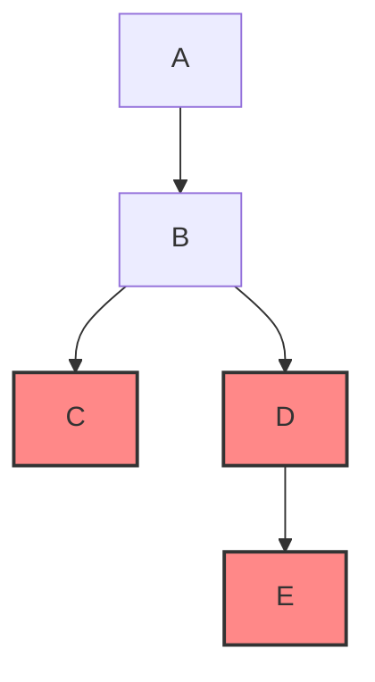

# 题意
给定一棵有根树 $T$，共有 $n$ 个顶点，以及 $n-1$ 条有向边。  
对每个顶点 $i$，其值为 $a_i$。顶点 $x$ 可从顶点 $y$ 到达（reachable），当且仅当存在一条从 $y$ 出发、以 $x$ 结束且仅沿着有向边行走的路径。保证所有顶点都可以从根到达（即根可达整个树）。

给定 $m$ 条顶点对 $(u_i, v_i)$，满足在原树中 $u_i$ 可从 $v_i$ 到达（即原树中存在从 $v_i$ 到 $u_i$ 的路径）。现在将这些有向边 $u_i \to v_i$ 添加到图中，形成一个新的有向图。

对于新的有向图，定义集合 $S$（可以为空）为 **amazing** 当且仅当：  
对任意 $x \in S$，在新图中从 $x$ 可到达的所有顶点都属于 $S$（即 $S$ 对可达闭包保持封闭）。集合 $S$ 的值定义为其所有元素值之和；空集的值为 $0$。

问：在所有 amazing 集合中，共出现了多少种不同的值？
## Input
- 第一行包含一个整数 $n$ $(1 \le n \le 10^4)$，表示树 $T$ 的顶点数。  
- 第二行包含 $n$ 个整数， 第 $i$ 个数表示 $a_i$，且满足 $0 \le a_i \le \sum_{i=1}^n a_i \le 10^4$。  
- 接下来 $n-1$ 行，每行两个整数 $U_i, V_i$ $(1 \le U_i, V_i \le n)$，表示存在一条从 $U_i$ 指向 $V_i$ 的有向边（这些行给出树的 $n-1$ 条有向边）。  
- 下一行包含一个整数 $m$ $(1 \le m \le 5 \times 10^5)$，表示要添加的新边数。  
- 接下来 $m$ 行，每行两个整数 $u_i, v_i$ $(1 \le u_i, v_i \le n)$，表示要新增一条从 $u_i$ 指向 $v_i$ 的有向边。输入保证对于每个新增边 $(u_i, v_i)$，在原树中 $u_i$ 是可从 $v_i$ 到达的（即原树存在从 $v_i$ 到 $u_i$ 的路径）。
## Output
- 输出一个整数，表示在所有 amazing 集合中出现的不同值的个数。
# Solution
## my
将题目整理成，在图上跑SCC缩点后的树中，有多少个集合，其可达点全部位于集合中。
不能只简单从树叶直接到根，赛时就没有注意到这点。

比如此时，红色类依然是满足题意的。
因此需要dp，而传统dp太慢了，所以想到bitset优化dp加启发式合并
对此启发式的解释是
每个`bit`会只记一次，所以是类似set的。我们可以假装有一个更劣的情况，即每次合并多记录一次，这样合并一定会更劣，而更劣的情况保证了O(nPlogP)摊还，所以更优的每`bit`合并一定会更快。最终复杂度为 $O(n \cdot \lfloor \frac{P}{64}\rfloor \log P)$ 其中$P = \max(a_i) = 1e4$ 
```cpp showLineNumbers title="my"
void solve()
{
    int n;
    cin >> n;
    vector<int>         ai(n);
    vector<vector<int>> raw(n, vector<int>());
    SCC                 scc(n + 1);
    for (int i = 0; i < n; i++) {
        cin >> ai[i];
    }
    vector<int> deg_in(n);
    for (int i = 0; i < n - 1; i++) {
        int u, v;
        cin >> u >> v;
        u--, v--;
        raw[u].pb(v);
        scc.addEdge(u, v);
        deg_in[v]++;
    }
    int m;
    cin >> m;
    for (int i = 0; i < m; i++) {
        int u, v;
        cin >> u >> v;
        u--, v--;
        if (u == v) continue;
        scc.addEdge(u, v);
    }
    scc.work();
    int root = -1;
    for (int i = 0; i < n; i++) {
        if (deg_in[i] == 0) {
            root = i;
            break;
        }
    }
    vector<set<int>>         newg(scc.cnt);
    vector<i64>              bi(scc.cnt);
    function<void(int, int)> dfs = [&](int u, int fa) -> void {
        bi[scc.bel[u]] += ai[u];
        for (int sons : raw[u]) {
            if (scc.bel[sons] != scc.bel[u]) {
                newg[scc.bel[u]].ins(scc.bel[sons]);
            }
            dfs(sons, u);
        }
    };
    dfs(root, -1);
    int               newroot = scc.bel[root];
    constexpr int     P       = 1e4 + 1;
    vector<bitset<P>> dp(scc.cnt);
    set<i64>          st;
 
    function<void(int, int)> dfs2 = [&](int u, int fa) -> void {
        dp[u][0]   = 1;
        bool first = 1;
        for (int sons : newg[u]) {
            dfs2(sons, u);
            bi[u] += bi[sons];
            if (first) {
                dp[u] = dp[sons];
                first = 0;
                continue;
            }
            bitset<P> old;
            auto&     a = dp[u];
            auto&     b = dp[sons];
            if (a.count() > b.count()) {
                swap(a, b);
            }
            for (int j = 0; j < P; j++) {
                if (a[j]) {
                    old |= b << j;
                }
            }
            dp[u] = old;
        }
        dp[u][bi[u]] = 1;
    };
    dfs2(newroot, -1);
    cout << dp[newroot].count() << '\n';
}
```
## std
首先将图建出来之后缩点，由于是树上加一些返祖边，我们可以得知缩点之后的图是一个外向树。那么我们实际是要求，在这棵树上，选出若干不交子树，总权值一共有多少种。
设计 dp 状态为 $f_{i,j} = 0/1$，表示 i 号点的子树内，选择了总权值为 $j$ 的若干不交子树，是否可行。转移直接树上背包合并即可。
时间复杂度瓶颈为小常数 $O((n + \sum a_i) \sum a_i)$。可以通过。可以进一步优化达到更优复杂度，但这不在本题的考察范围内。
>单纯的 $O((n + \sum a_i) \sum a_i)$ 能过还是太极限了。。。建议启发式合并进行优化
